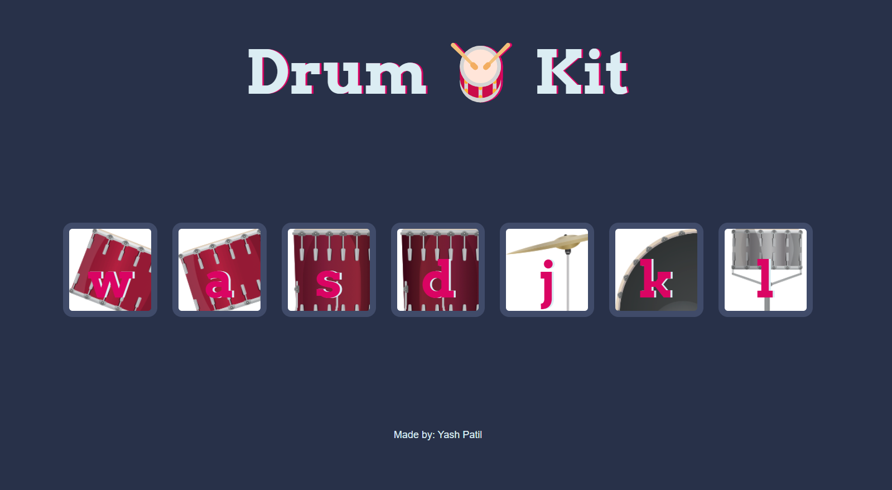

# 🎵 Music Maker Web App

## 📌 Project Overview
This interactive **Music Maker Web App** allows users to create music by clicking on **alphabets, images, or using keyboard keys** to play beats. It's a fun and engaging project designed for beginners who are learning **JavaScript**.

## 🌟 Features
- **Click or Press Keys** – Play beats by clicking images or using keyboard keys.
- **Multiple Sound Options** – Various beats to experiment with.
- **Beginner-Friendly** – A great project for learning JavaScript event handling.
- **Interactive UI** – Visually appealing interface for easy usability.

## 🛠️ Tech Stack
- **HTML** – Structure of the web app.
- **CSS** – Styling for an interactive and engaging UI.
- **JavaScript** – Core logic for handling sound and keyboard inputs.

## 📂 Project Structure
```
📦 Music-Maker-WebApp
 ┣ 📜 index.html        # Main HTML structure
 ┣ 📜 style.css         # Styling and layout
 ┗ 📜 script.js         # JavaScript logic for playing beats
```

## ▶️ How to Run
1. **Clone the repository**:
   ```bash
   git clone https://github.com/yashpatil-1/Music-Maker-WebApp.git
   cd Music-Maker-WebApp
   ```
2. **Open `index.html`** in any modern web browser.
3. **Click on alphabets, images, or use keyboard keys** to play sounds.

## 📸 Screenshot



## 🎯 Future Enhancements
- Add **customizable beats** for users to upload their own sounds.
- Implement a **record and playback feature**.
- Improve the UI with **animated visual effects**.

## 🤝 Contributing
Feel free to fork this repository, enhance features, and submit a pull request.

## 📜 License
This project is licensed under the **MIT License**.

## 📞 Contact
For any questions, reach out via **[workwithme.3215@gmail.com](mailto:workwithme.3215@gmail.com)** or visit my **[GitHub Profile](https://github.com/yashpatil-1)**.

---
🎶 **Make music, experiment with beats, and have fun!** 🚀

